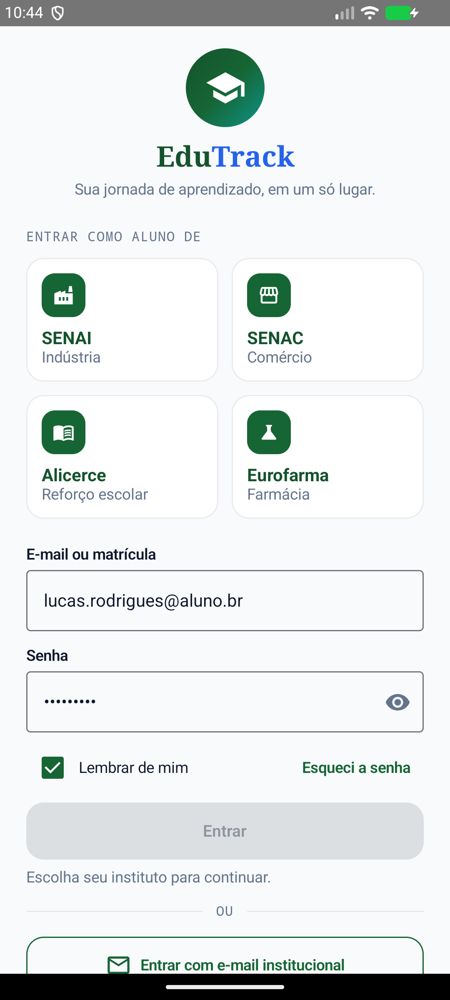
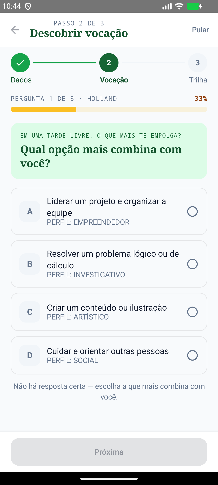
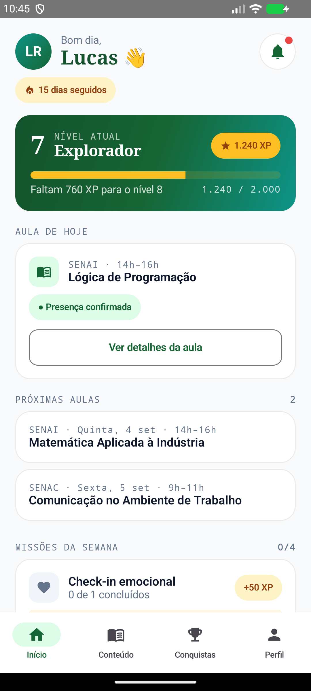
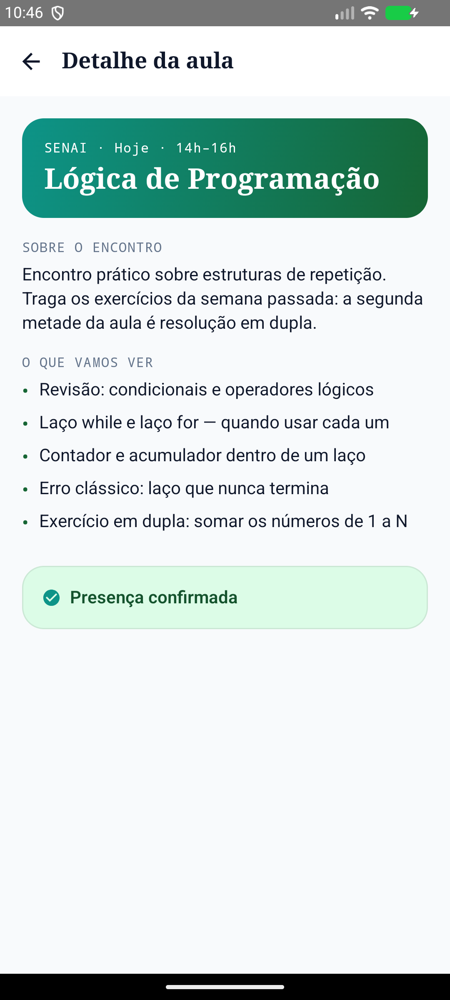
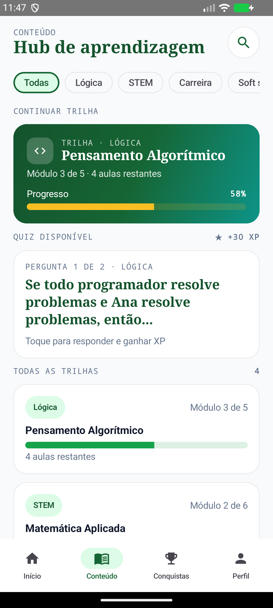
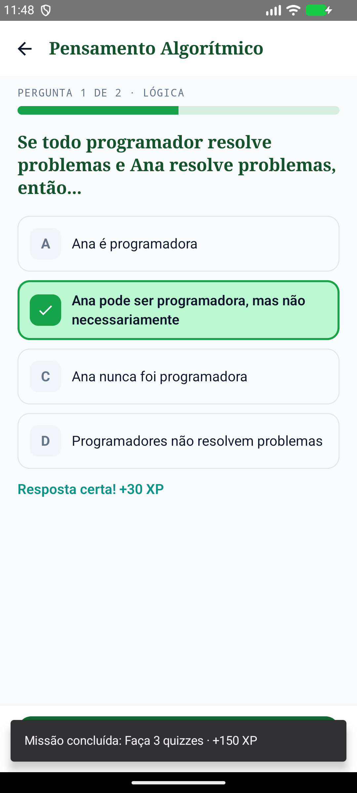
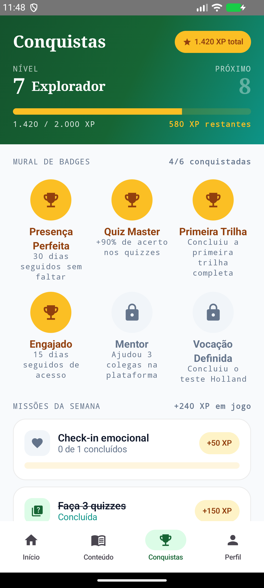
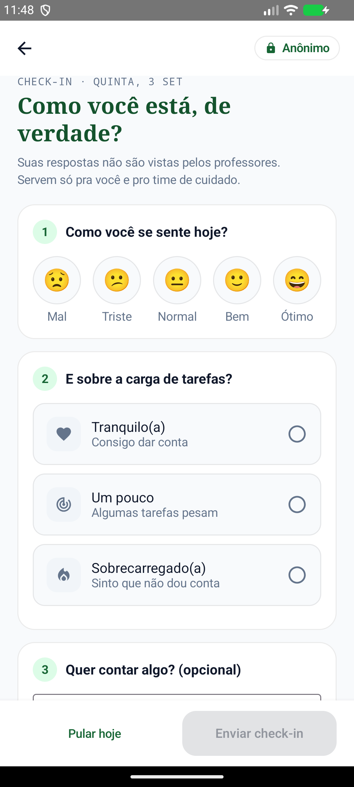
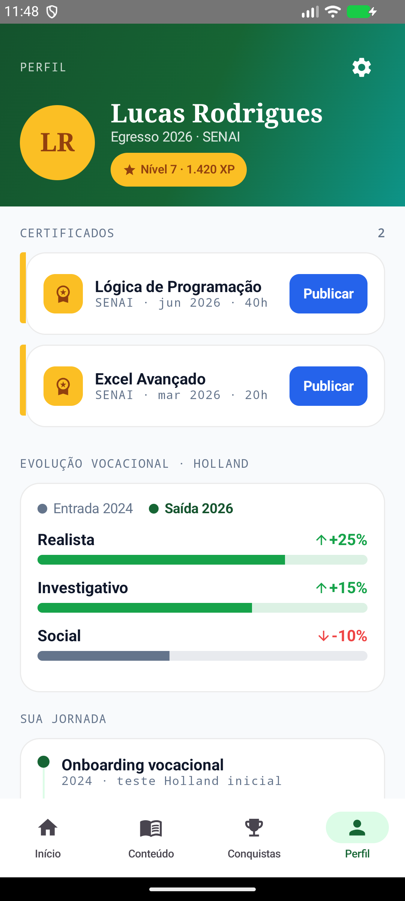

# EduTrack

Aplicativo Android que conecta o aluno de institutos parceiros (SENAI, SENAC, Instituto Alicerce e Instituto Eurofarma) a uma jornada única de aprendizagem, com trilhas de conteúdo, gamificação, acompanhamento vocacional e check-in emocional — pensado para reduzir a evasão escolar e dar visibilidade sobre o engajamento e o bem-estar do aluno.

> **Entrega:** Sprint 3 — MVP navegável em Kotlin/Jetpack Compose, com dados mockados (sem integração com API, Firebase ou backend nesta etapa).

## Identificação

- **Nome do projeto:** EduTrack
- **Nome da equipe:** 3SIR — EuroForce 
- **Turma:** 3SIR — FIAP · Challenge 2026 · Instituto Eurofarma
- **Matéria:** Android Kotlin Developer

### Integrantes

| Nome completo | RM |
|---|---|
| Enzo Grisolia de Souza | 555706 |
| Gabriel Borges Medeiros | 556142 |
| Guilherme de Nicola Nesti | 555044 |
| Lucas Rodrigues Alves | 555377 |
| Matheus Lion Muzzi | 555764 |


### Link do repositório


https://github.com/Lucas-RA/Edutrack_App

## Objetivo do aplicativo

O EduTrack existe para que o aluno enxergue, num só lugar, sua evolução dentro do instituto parceiro: presença, trilhas de conteúdo, conquistas e como está se sentindo ao longo do percurso.

A proposta parte do problema de evasão em programas de formação profissionalizante — quando o aluno não vê o próprio progresso e ninguém percebe sinais de sobrecarga a tempo, ele some. O app ataca isso com uma Home orientada a "o que fazer agora", gamificação que reconhece esforço (não só resultado) e um check-in emocional anônimo e leve.

---

## Escopo funcional implementado

### (a) Requisitos funcionais escolhidos

Os requisitos vêm do modelo ArchiMate da Sprint 2. 

| ID | Requisito | Cobertura nesta Sprint |
|---|---|---|
| RF-04 | Atualizar linha do tempo com presença, atividades, XP e certificados | **Parcial** — Home, detalhe da aula e Perfil Vivo mostram e atualizam a linha do tempo; falta o histórico completo por data |
| RF-07 | Disponibilizar conteúdos, quizzes e missões semanais | **Completa** — Hub de conteúdo, Quiz por trilha e missões da semana |
| RF-08 | Coletar check-in emocional anônimo e consolidado por turma | **Parcial** — a coleta individual está implementada; a consolidação por turma é da camada de dados e fere o anonimato se feita no app |
| RF-09 | Manter perfil vivo com histórico de jornada | **Completa** — Perfil Vivo com certificados, evolução Holland e timeline |
| RF-10 | Registrar certificados, badges e destino pós-formação | **Parcial** — certificados e badges implementados; o destino pós-formação não |


### (b) O que foi implementado

| Tela | O que faz | Requisito |
|---|---|---|
| **Login multi-instituto** | Escolha do instituto parceiro antes de entrar, com formulário funcional (campos editáveis, senha mascarada, botão travado até haver instituto e e-mail) | Constraint C1 visível |
| **Onboarding vocacional** | Teste Holland (RIASEC) com seleção confirmada em "Próxima", volta para a pergunta anterior e tela de resultado com o perfil dominante | Alimenta RF-09 |
| **Home** | Nível e XP, streak, aula do dia, próximas aulas, missões da semana e atalhos | RF-04, RF-07 |
| **Detalhe da aula** | Tópicos do encontro e confirmação de presença, que soma XP e avança a missão de aulas | RF-04 |
| **Hub de conteúdo** | Trilhas por área com busca e filtro, "continuar trilha" e quiz em destaque | RF-07 |
| **Quiz** | Perguntas por trilha, retorno imediato de acerto/erro, XP e progresso da missão | RF-07 |
| **Conquistas** | XP, nível, mural de badges (desbloqueados em tempo de execução) e missões da semana | RF-07, RF-10 |
| **Check-in emocional** | Humor, carga de tarefas e comentário livre; registra o check-in, soma XP e fecha a missão | RF-08 |
| **Perfil Vivo** | Certificados publicáveis, evolução vocacional e timeline da jornada | RF-09, RF-10 |

### (c) Justificativa da priorização

O aplicativo Android é o canal do **educando** — não do instrutor nem do gestor. Dos 12 requisitos funcionais do projeto, 7 pertencem a perfis que operam pela web (registro de presença, histórico de alterações, KPIs de gestão, exportação de relatórios) ou dependem de decisões e integrações fora do escopo desta Sprint: a importação do Moodle exigiria integração com API, vedada pelo enunciado, e o cálculo do score de risco depende de uma fórmula ainda em definição pela equipe. Os 5 requisitos restantes são exatamente os que o aluno toca na palma da mão, e foram priorizados por isso.

Dentro desses 5, a ordem de implementação seguiu o ciclo de uso real: entrar → entender o próprio perfil → estudar → ser reconhecido por isso → contar como está se sentindo → ver tudo reunido no perfil. É esse ciclo que o avaliador consegue percorrer de ponta a ponta no app.

### (d) Relação com o problema do pitch

O pitch das Sprints anteriores levantou três dores no acompanhamento de alunos de programas profissionalizantes:

1. **Fragmentação de dados** — o aluno não vê o próprio progresso inteiro, porque presença, conteúdo e conquistas moram em sistemas diferentes. A **Home**, o **Hub de conteúdo** e o **Perfil Vivo** reúnem isso numa narrativa só.
2. **Ruptura de vínculo** — nada sobrevive à formatura. O **Perfil Vivo**, com certificados publicáveis e evolução vocacional, é o artefato que o egresso leva consigo.
3. **Percepção tardia de sobrecarga** — quando alguém nota, o aluno já saiu. O **check-in emocional** é o mecanismo de percepção precoce, e a tela diz na própria interface que o professor não vê a resposta individual (constraint C4).

O **login multi-instituto** é a materialização visível da constraint C1: uma identidade EduTrack única, com múltiplos parceiros por baixo.

---

## Prints das telas

### 1. Login multi-instituto



Porta de entrada do app. O aluno escolhe o instituto parceiro numa grade de quatro cartões e entra com e-mail institucional. O botão **Entrar** só habilita depois que um instituto é selecionado — se não houver escolha, a tela explica o que falta.

### 2. Onboarding vocacional



Teste curto baseado no modelo Holland (RIASEC). O aluno seleciona uma alternativa e confirma em **Próxima**; pode voltar e trocar a resposta anterior. Ao fim, a própria tela mostra o perfil dominante e explica como ele orienta as trilhas.

### 3. Home do aluno



Centro de comando diário: nível e XP atuais, streak de dias seguidos, aula de hoje com estado de presença, próximas aulas da agenda, missões da semana e atalhos para as demais áreas.

### 4. Detalhe da aula



Aberta ao tocar numa aula da Home. Mostra descrição e tópicos do encontro e permite confirmar presença — o que soma XP e avança a missão de aulas, com retorno visual imediato.

### 5. Hub de conteúdo



Catálogo de trilhas por área, com busca e filtro por categoria, destaque para a trilha em andamento e o quiz disponível daquela trilha.

### 6. Quiz da trilha



Aberta a partir de uma trilha, recebendo o identificador dela como parâmetro de rota. Dá retorno imediato: a alternativa correta fica verde com um check, a errada fica vermelha, e o acerto soma XP.

### 7. Conquistas



Faixa de nível com progresso até o próximo, mural de badges (os bloqueados aparecem com cadeado) e missões da semana com XP em jogo. Badges são desbloqueados em tempo de execução, conforme o aluno usa o app.

### 8. Check-in emocional



Termômetro diário em três blocos: humor, percepção de carga de tarefas e um campo livre opcional. A tela declara que as respostas não são vistas pelos professores.

### 9. Perfil Vivo



Portfólio do aluno: certificados prontos para publicar, evolução do perfil vocacional entre a entrada e a saída do programa, e a timeline da jornada.

---

## Dados mockados

 **Todos os dados vêm de `data/mock/MockDataProvider.kt`**, um `object` único que funciona como fonte de verdade do app.

**Modelos** — 11 arquivos em `data/model/`, com 12 `data class` e 5 `enum class`: `Aluno`, `Instituto`, `Aula`, `Trilha` (+ `AreaTrilha`), `Quiz`, `Missao` (+ `TipoMissao`), `Badge`, `Certificado`, `CheckInRegistro` (+ `Humor`, `CargaTarefas`), `PerguntaOnboarding` / `OpcaoOnboarding` (+ `PerfilHolland`) e `EvolucaoVocacional`.

**Conteúdo dos dados** — um cenário coerente de aluno do SENAI: 4 institutos parceiros, 3 aulas com tópicos reais de Lógica de Programação, Matemática Aplicada e Comunicação, 4 trilhas, 7 quizzes com alternativas plausíveis, 4 missões semanais, 6 badges, 2 certificados e o histórico vocacional. Nada de "Item 1", "Teste" ou lorem ipsum.

**O que muda em tempo de execução** — esta é a parte que o critério 5 chama de "simulação de fluxos". O `EduTrackRepository` guarda o estado vivo em `MutableStateFlow` e expõe `StateFlow`; o `EduTrackViewModel` aplica as regras e grava de volta:

| Ação do aluno | O que muda |
|---|---|
| Acertar um quiz | Soma XP e avança a missão de quizzes |
| Confirmar presença numa aula | Marca a aula, soma XP e avança a missão de aulas |
| Enviar o check-in | Cria um registro no topo da lista, soma XP e fecha a missão de check-in |
| Publicar um certificado | Muda o certificado para publicado |
| Concluir o onboarding | Desbloqueia o badge "Vocação Definida" |
| Fechar qualquer missão | Soma o XP da missão e desbloqueia o badge correspondente |

Como o ViewModel é único e compartilhado pelo grafo de navegação, o XP ganho no quiz aparece na hora em Conquistas e no Perfil, sem nenhum código de sincronização entre telas.

---

## Tecnologias utilizadas

- **Kotlin** 1.9.24
- **Jetpack Compose** (BOM 2024.06) + **Material 3**
- **Navigation Compose** 2.7.7
- **Lifecycle ViewModel Compose** e **Lifecycle Runtime Compose** 2.8.4
- **Arquitetura MVVM** com injeção manual, sem Hilt nem Koin

**Recursos técnicos da disciplina, e onde eles aparecem:**

- **Navegação com `Scaffold` + `innerPadding` + `NavController`** — o `EduTrackNavHost` monta um `Scaffold` com barra inferior e `SnackbarHost`, e repassa o `innerPadding` ao `NavHost`, para o conteúdo nunca ficar sob a barra.
- **Passagem de parâmetro na rota** — duas rotas parametrizadas, `quiz/{trilhaId}` e `aula/{aulaId}`, recuperadas com `backStackEntry.arguments?.getString(...)`. É o padrão "lista → detalhe" que o enunciado cita.
- **Listas dinâmicas** — `LazyColumn` e `LazyRow` no hub de conteúdo, com filtro por área e busca por texto.
- **Gerenciamento de estado** — estado observável em `StateFlow`, consumido nas telas com `collectAsStateWithLifecycle()`; estado puramente local de tela (índice do quiz, campos do formulário) permanece em `remember`.
- **Injeção manual do ViewModel** — `EduTrackViewModelFactory` deixa a cadeia `MockDataProvider → EduTrackRepository → EduTrackViewModel` visível num lugar só.
- **Retorno visual** — cada ação do aluno dispara um `Snackbar` a partir de um `SharedFlow` de mensagens do ViewModel.
- **Componentização** — 19 componentes reutilizáveis em `ui/components/`, organizados por tipo, com `@Preview`.
- **Material Design** — tema próprio em `ui/theme/`, com três famílias tipográficas nativas e tokens de cor centralizados.

---

## Estrutura do projeto

```
app/src/main/java/com/fiap/edutrack/
├── MainActivity.kt          # Ponto de entrada: aplica o tema e chama o NavHost
├── data/
│   ├── model/               # 11 arquivos de modelo (Aluno, Trilha, Quiz, Missao, ...)
│   └── mock/                # MockDataProvider — fonte única dos dados
├── repository/              # EduTrackRepository — dono do estado vivo (StateFlow)
├── viewmodel/               # ViewModel único + factory manual
├── util/                    # Funções puras: XP, formatação de texto e de data
├── ui/
│   ├── theme/               # Cores, tipografia e formas
│   ├── components/          # Componentes reutilizáveis, organizados por tipo
│   └── screens/             # Uma pasta por tela
└── navigation/              # Rotas e NavHost
```

---

## Como executar

1. **Android Studio Quail 3 | 2026.1.3** (build `AI-261.26222.65.2613.15948027`), com o JDK 25 que já vem embutido.
2. Abra a pasta **`EduTrack`** (não a pasta que a contém) em *File → Open*.
3. Aguarde o Gradle sincronizar. O wrapper já está versionado no projeto (`gradlew`, `gradlew.bat` e `gradle/wrapper/gradle-wrapper.jar`), então nada precisa ser instalado à mão.
4. Rode em um emulador ou aparelho com **Android 7.0 (API 24) ou superior**.
5. O app abre na tela de **Login** — escolha um instituto e toque em **Entrar** para percorrer o fluxo completo.

Pela linha de comando, para gerar o APK de depuração:

```bash
./gradlew assembleDebug
```

**Configuração do projeto:** `compileSdk` 34 · `minSdk` 24 · `targetSdk` 34 · `applicationId` `com.fiap.edutrack`.

**Dependências relevantes:** AndroidX Core KTX 1.13.1, Activity Compose 1.9.1, Lifecycle Runtime KTX / ViewModel Compose / Runtime Compose 2.8.4, Compose BOM 2024.06.00, Material 3, Material Icons Extended, Navigation Compose 2.7.7.

---

## Observações

- Nesta Sprint **não há** integração com API, Firebase, banco de dados local ou backend — os dados são mockados propositalmente, conforme o enunciado.
- A separação em `repository/` deixa o projeto pronto para essa integração: basta trocar a origem dos dados dentro do repositório, sem tocar nas telas.
- O app roda **offline**, sem nenhuma permissão declarada no manifest.
